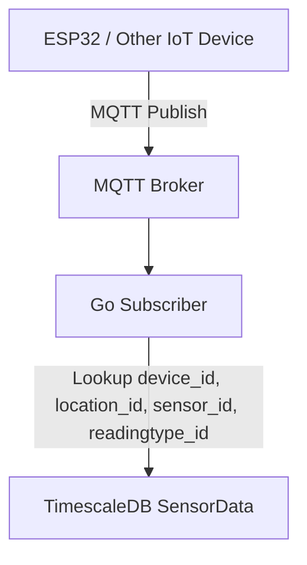

# IoT Sensor Architecture

- **Device**
  - Unique identifier
  - Assigned to a **Location**
  - Maps to multiple Sensors over time (many-to-many via device_sensors table)

- **Location**
  - Name, coordinates, or description
  - Optional metadata

- **Sensor**
  - Physical device (BME280, BME680, SCD41, etc.)
  - Can provide multiple reading types

- **ReadingType**
  - Measurement type / metric (temperature, humidity, CO2, VOC, etc.)
  - Essentially defines **what the sensor measures**

- **DeviceSensorReading**
  - Mapping table: device -> sensor -> reading type
  - Enforces **one sensor per reading type per device at a time**

- **SensorData**
  - Tall time-series table with:
    - timestamp
    - device_id
    - location_id
    - sensor_id
    - readingtype_id
    - value
  - Hypertable in TimescaleDB for efficient storage

---

